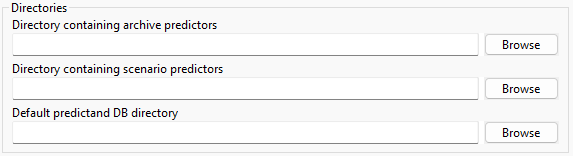
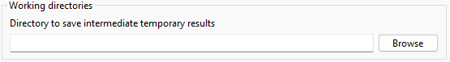
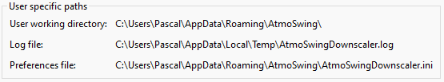

Preferences
===========

The preferences frame can be opened from the menu Options / Preferences of the main interface or with a button from the toolbar.

General options
---------------

Language
~~~~~~~~

The language can be changed from the drop-down list. The change is effective after restarting the software.

.. image:: img/preferences-general-language.png
   :align: center

Log options
~~~~~~~~~~~

Log preferences control the display of the log window and the level (importance) of reported messages:

1. Errors only - recommended as long as everything goes as planned.
2. Errors and warnings - some warnings help to be vigilant in case of problems. However, there might be warnings even during regular operation.
3. Verbose - all operations are reported, which is an unnecessary amount of information during regular operation. As a result, important messages might be hidden in a large number of messages. This option is only useful to identify where AtmoSwing is failing.

.. image:: img/preferences-general-log.png
   :align: center

Directories
~~~~~~~~~~~

Different directories must be specified:

* Directory containing the archive predictors: predictor describing the candidate situations (for example :ref:`reanalyses<reanalyses>`).
* Directory containing the scenario predictors: predictor describing the target situations (for example :ref:`CMIP5 or CORDEX<data-downscaler>`).
* Directory containing the predictand DB (:ref:`NetCDF file generated from the predictand data<predictand-db>`).

Advanced options
----------------

Graphical User Interface (GUI) options
~~~~~~~~~~~~~~~~~~~~~~~~~~~~~~~~~~~~~~

Options to control the behavior of the interface and its means of communication with the user. Saves calculation time by disabling dialog boxes. The choices are:

* Silent - no dialog box is displayed. The user must, therefore, keep an eye on the log window to detect any error. This option is only useful for very intensive calculations.
* Standard - recommended for regular use.
* Verbose - a bit more verbose than the Standard option.

.. image:: img/preferences-adv-gui.png
   :align: center

Multithreading
~~~~~~~~~~~~~~

Options for using multiple threads:

* Allow multithreading - allows a gain in performance for the calculations (recommended).
* Maximum number of threads - to be chosen according to the computer's CPU. The software automatically proposes the optimal number of threads for the computer in use.
* Threads priority - allows defining the priority of the threads in competition with other ongoing processes.

.. image:: img/preferences-adv-multithreading.png
   :align: center
   
Processing options
~~~~~~~~~~~~~~~~~~

These options influence how the search for analogs is performed, which has no impact on the results, only on the calculation time. The choices are as follows:

* Multithreaded - as long as the computer has at least two processors. It is the fastest version.
* Standard - this option is slower than the previous one as it uses a single thread.

.. image:: img/preferences-adv-processing.png
   :align: center

Working directory
~~~~~~~~~~~~~~~~~

A working directory can be specified to save optional intermediate files, for example between levels of analogy.

User-specific paths
~~~~~~~~~~~~~~~~~~~

Some paths automatically defined according to the OS: working directory, log file, and preferences file.
   

   
