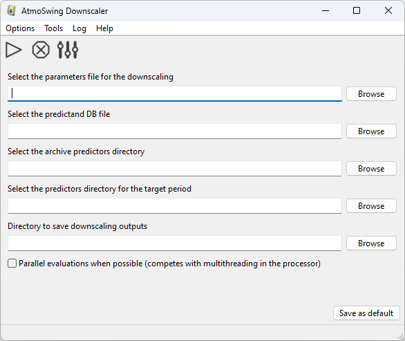

Usage
=====

The Downscaler allows the AMs to be used in a climatic context, either for climate reconstruction or for climate change impact studies. When used for future climate impact, the user must pay close attention to the selected predictors, so that they can represent the climate change signal. It is a relatively new field of application of AMs.

.. warning::
    The Downscaler is the last addition to AtmoSwing and has therefore not been tested/used as intensively as the other tools. Some bugs might be encountered. Please report them as `GitHub issues <https://github.com/atmoswing/atmoswing/issues>`_ or contact the developer directly.

Requirements
------------

The Downscaler needs:

* :ref:`A predictand database <predictand-db>`
* :ref:`Predictors from the target period <data-downscaler>`
* :ref:`A predictors archive (e.g. a reanalysis dataset) <reanalyses>`
* :ref:`Parameters file defining the properties of the method. <parameters-file-downscaler>`

Outputs
-------

The Downscaler produces compressed **NetCDF files** containing:

* The values of the predictand for the target period
* The analog dates
* The values of the analogy criteria
* The target dates
* Some reference values (e.g., precipitation for different return periods)
* Some station metadata (id, name, coordinates, height)

Graphical user interface
------------------------

The main interface of the Downscaler is as follows.

.. TODO: Replace the figure with a new screenshot (typo already corrected in GUI but not in figure)

The toolbar allows the following actions:

- |icon_run| Start the calculations.
- |icon_stop| Stop the current calculations.
- |icon_preferences| Define the preferences.

.. |icon_run| image:: img/icon-run.png
   :align: middle
   
.. |icon_stop| image:: img/icon-stop.png
   :align: middle

.. |icon_preferences| image:: img/icon-preferences.png
   :align: middle
   
What is needed:

* :ref:`The parameters file for downscaling <parameters-file-downscaler>`
* The predictand DB
* The directory containing the predictors for the archive period
* The directory containing the predictors for the target period
* The directory to save the downscaling results

Command line interface
----------------------

The Downscaler also has a command line interface. The options are as follows:

-h, --help  Displays the help of command line options
-v, --version  Displays the software version
-r, --run-number=<nb>  A given run number
-f, --file-parameters=<file>  File containing the downscaling parameters
--predictand-db=<file>  The predictand DB
--station-id=<id>  The predictand station ID
--dir-archive-predictors=<dir>  The archive predictors directory
--dir-scenario-predictors=<dir>  The scenario predictors directory
--downscaling-method=<method>  Choice of the downscaling method (classic: classic downscaling)
-n, --threads-nb=<n>  Number of threads to use
-s, --silent  Silent mode
-l, --local  Work in local directory
--log-level=<n>  Set the log level (0: minimum, 1: errors, 2: warnings (default), 3: verbose)
