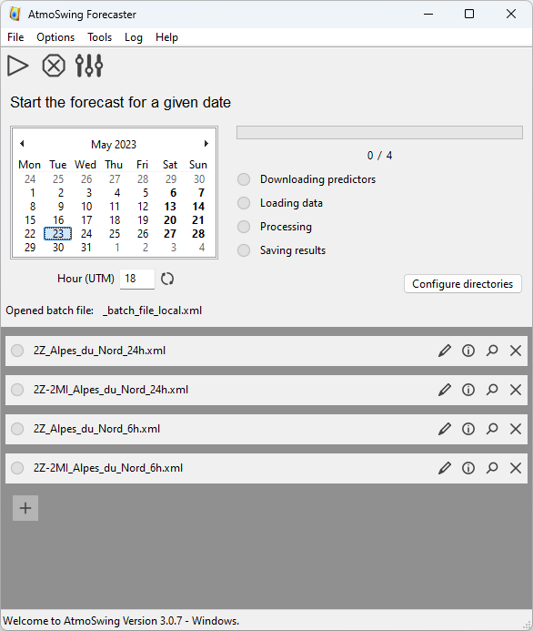

.. _app-forecaster:

The Forecaster
==============

Graphical user interface
------------------------

This tool allows you to do the following actions:

* Calculate the current forecast or for a given date
* Define the list of templates to be performed by default (also for command line mode)
* Generate the precipitation database

The toolbar allows the following actions:

- |icon_run| Run the forecast for the chosen date and time.
- |icon_stop| Stop the current calculations.
- |icon_preferences| Open the interface for setting preferences.

.. |icon_run| image:: app-forecaster/img/icon_run.png
   :align: middle
   
.. |icon_stop| image:: app-forecaster/img/icon_stop.png
   :align: middle

.. |icon_preferences| image:: app-forecaster/img/icon_preferences.png
   :align: middle

The real-time forecast calculation can be performed by a standard computer, without special resources. The forecast can be executed on demand through the graphical interface or command lines, which allows it to be automated on a server. Both aspects are explained below.

To perform a forecast, you must:

1. Choose the date from the calendar and the time below. When the software is started, the date and time are the current values. The |icon_update| icon then allows you to update to the current values.
2. Execute the forecast by clicking on the |icon_run_s| icon in the toolbar.

.. |icon_run_s| image:: app-forecaster/img/icon_run.png
   :width: 32
   :height: 32
   :scale: 50
   :align: middle
   
The models executed are those listed in the lower part of the interface. The editing of this list is described in the following Section. The models are executed one after the other. An |icon_bullet_yellow| icon means that the model is being calculated, |icon_bullet_green| that the calculations have been successfully performed and |icon_bullet_red| that the forecast has failed for this model.

Define the list of models
~~~~~~~~~~~~~~~~~~~~~~~~~

The list of models can be completed or models can be deleted. A model is an optimal specific parameterization for a deadline and a region. It is represented in the graphical user interface by a choice of parameter files. A template can be removed by the |icon_close| icon. It is also possible to add templates using the |icon_plus| icon below the list.

When the list of models has been modified and we want to keep it by default, it is necessary to save it, otherwise the list will be reset by restarting the software. To do this, use the menu item File / Save models list as default. This action irreversibly overwrites the previous list.

Command line interface
----------------------

Atmoswing can be used with a command line interface. This makes it possible to automate forecasts on a server. The options are as follows:

-h, --help  Displays the help of command line options
-c, --config  Configure the forecaster
-v, --version  Displays the software version
-f, --batch-file=file  Batch file to use for the forecast (full path)
-n, --forecast-now  Run forecast for the latest available data
-p, --forecast-past=nb_days  Run forecast for the given number of past days
-d, --forecast-date=<YYYYMMDDHH>  Run forecast for a specified date
-l, --log-level=n  Set the log level (0: minimum, 1: errors, 2: warnings (default), 3: verbose)
--proxy=<host[:port]>  Use proxy on given port
--proxy-user=<user[:password]>  Proxy user and password

A scheduled task can be added on ther server (ex: Task Scheduler on Windows or Cron task on Linux).

.. toctree::
   :maxdepth: 2
   :hidden:
   
   app-forecaster/preferences