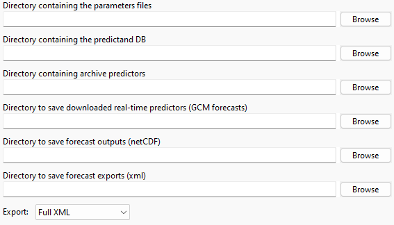
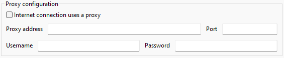
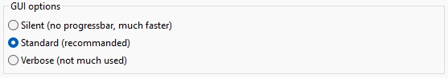
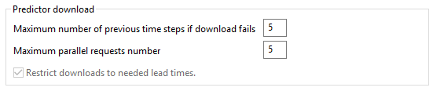
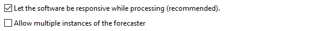
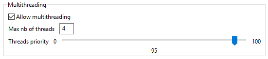
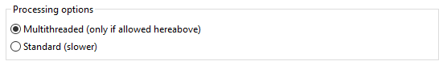
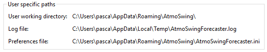

Preferences
===========

.. todo:: write

Batch file properties
---------------------

Different directories must be specified for real-time forecasting:

* Directory containing the forecast parameter files - contains the xml files defining by the method parameters
* Directory containing the predictors archives.
* Directory for recording downloaded predictors. Subdirectories are automatically created for each date according to the Year/Month/Day tree structure.
* Directory for recording forecast results - location where these results are stored. Subdirectories are also generated for each date.
* Directory containing the precipitation database - this database is a NetCDF file.

Log options
-----------

Log preferences are specific to each tool. They define the display of the log window and the level of reported log:

1. Only errors - recommended as long as everything goes as planned.
2. Errors and warnings - some warnings help to be vigilant in case of problems. However, there might be warnings even during normal operation.
3. All messages - all operations are reported, which is an unnecessary amount of information during normal operation. As a result, important messages are hidden in the standard operating flow, the program is slowed down and its memory usage increases. This option is useful for identifying the source of an error in case of problems.

.. image:: img/preferences-general-log.png

Internet proxy
--------------

The proxy configuration contains the following elements:

* Proxy activation - if necessary.
* Proxy properties - provide the address, port, user name and password.

