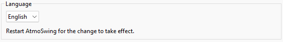
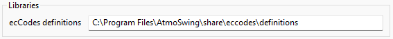

Preferences
===========

The preferences frame can be opened from the menu Options / Preferences of the main interface or with a button from the toolbar.

Batch file properties
---------------------

Different directories must be specified for operational forecasting:

* Directory containing the parameters files: contains the :ref:`xml parameters files (defining by the method parameters)<parameters-file-forecaster>`
* Directory containing the predictand DB: contains the :ref:`NetCDF file generated from the predictand data<predictand-db>`.
* Directory containing the archive predictors: predictor describing the candidate situations (for example :ref:`reanalyses<reanalyses>`).
* Directory to save downloaded real-time predictors: the operational NWP model outputs. Subdirectories are automatically created for each date according to a year/month/day structure (respectively \\ on Windows).
* Directory to save the forecast outputs (NetCDF): location where the results are stored. Subdirectories are also generated for each date.
* Directory to save the forecast exports (xml/csv): location where the synthesis xml file is saved.

In addition, the export format can be selected (for example, full XML or small CSV).

.. image:: img/preferences-paths-forecasting.png
   :align: center
   
General options
---------------

Language
~~~~~~~~

The language can be changed from the drop-down list. The change is effective after restarting the software.

Log options
~~~~~~~~~~~

Log preferences control the display of the log window and the level (importance) of reported messages:

1. Errors only - recommended as long as everything goes as planned.
2. Errors and warnings - some warnings help to be vigilant in case of problems. However, there might be warnings even during regular operation.
3. Verbose - all operations are reported, which is an unnecessary amount of information during regular operation. As a result, important messages might be hidden in a large number of messages. This option is only useful to identify where AtmoSwing is failing.

.. image:: img/preferences-general-log.png
   :align: center

Internet proxy
~~~~~~~~~~~~~~

The proxy configuration contains the following elements:

* Proxy activation - if necessary.
* Proxy properties - the proxy address, port, the user name, and password.

.. image:: img/preferences-general-proxy.png
   :align: center

Libraries options
~~~~~~~~~~~~~~~~~

The path to the ecCodes definitions can be specified. These files are used to decode the GRIB files. The default path is automatically set during installation.

Advanced options
----------------

The advanced options are automatically configured and usually do not need to be changed.

Graphical User Interface (GUI) options
~~~~~~~~~~~~~~~~~~~~~~~~~~~~~~~~~~~~~~

Options to control the behavior of the interface and its means of communication with the user. Saves calculation time by disabling dialog boxes. The choices are:

* Silent - no dialog box is displayed. The user must, therefore, keep an eye on the log window to detect any error. This option is only useful for very intensive calculations.
* Standard - recommended for regular use.
* Verbose - a bit more verbose than the Standard option.

.. image:: img/preferences-adv-gui.png
   :align: center
   
Predictor download
~~~~~~~~~~~~~~~~~~

Options for automatic predictor download. The "maximum number of previous time steps if the download fails" corresponds to the number of attempts to retrieve data issued earlier if the desired data cannot be downloaded; this number must be greater than 2 to ensure proper operation of the Forecaster. Indeed, the latest NWP outputs are never instantly accessible, but after a certain delay. In this case, the most recent available data must be used.

.. image:: img/preferences-adv-downloads.png
   :align: center
   
Advanced options
~~~~~~~~~~~~~~~~

Different options can control the software's behavior:

* Enable or disable the reactivity of the graphical interface. This option must always be enabled for regular use.
* Allow multiple instances of the Forecaster.

.. image:: img/preferences-adv-advancedoptions.png
   :align: center
   
Multithreading
~~~~~~~~~~~~~~

Options for using multiple threads:

* Allow multithreading - allows a gain in performance for the calculations (recommended).
* Maximum number of threads - to be chosen according to the computer's CPU. The software automatically proposes the optimal number of threads for the computer in use.
* Threads priority - allows defining the priority of the threads in competition with other ongoing processes.

.. image:: img/preferences-adv-multithreading.png
   :align: center
   
Processing options
~~~~~~~~~~~~~~~~~~

These options influence how the search for analogs is performed, which has no impact on the results, only on the calculation time. The choices are as follows:

* Multithreaded - as long as the computer has at least two processors. It is the fastest version.
* Standard - this option is slower than the previous one as it uses a single thread.

.. image:: img/preferences-adv-processing.png
   :align: center
   
User specific paths
~~~~~~~~~~~~~~~~~~~

Some paths automatically defined according to the OS: working directory, log file, and preferences file.

.. image:: img/preferences-adv-userpaths.png
   :align: center
   
