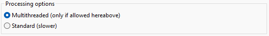

Preferences
===========

The preferences frame can be opened from the menu Options / Preferences of the main interface.

Batch file properties
---------------------

Different directories must be specified for operational forecasting:

* Directory containing the parameters files: contains the :ref:`xml parameters files (defining by the method parameters)<parameters-file-forecaster>`
* Directory containing the predictand DB: contains the :ref:`NetCDF file generated from the predictand data<predictand-db>`.
* Directory containing the archive predictors: predictor describing the candidate situations (for example :ref:`reanalyses<reanalyses>`).
* Directory to save downloaded real-time predictors: the operational NWP model outputs. Subdirectories are automatically created for each date according to a year/month/day structure.
* Directory to save the forecast outputs (NetCDF): location where the results are stored. Subdirectories are also generated for each date.
* Directory to save the forecast exports (xml): location where the synthesis xml file is saved.

.. image:: img/preferences-paths-forecasting.png
   :align: center
   
Log options
-----------

Log preferences control the display of the log window and the level (importance) of reported messages:

1. Errors only - recommended as long as everything goes as planned.
2. Errors and warnings - some warnings help to be vigilant in case of problems. However, there might be warnings even during normal operation.
3. Verbose - all operations are reported, which is an unnecessary amount of information during normal operation. As a result, important messages might be hidden in a large amount of messages. This option is only useful to identify where AtmoSwing is failing.

.. image:: img/preferences-general-log.png
   :align: center
   
Internet proxy
--------------

The proxy configuration contains the following elements:

* Proxy activation - if necessary.
* Proxy properties - the proxy address, port, the user name and password.

.. image:: img/preferences-general-proxy.png
   :align: center
   
Advanced options
----------------

The advanced options are automatically configured and usually do not need to be changed.

Graphical User Interface (GUI) options: Adjusts the behavior of the interface and its means of communication with the user. Saves calculation time by disabling dialog boxes. The choices are:

* Silent - no dialog box is displayed. The user must therefore keep an eye on the log window to detect any error. This option is only useful for very intensive calculations.
* Standard - recommended for standard use.
* Verbose - a bit more versose than the Standard option.

   
Predictor Download: Options for automatic predictor download. The choices are:

* Number of attempts on previous data if the desired data cannot be downloaded; this number must be greater than 2 to ensure proper operation of the forecast tool. Indeed, the latest model results are never instantly accessible, but after a delay of several hours. In this case, we must take the most recent data available.
* Number of parallel downloads - parallel requests reduce download times. However, be careful not to put a too large number (5 being sufficient), at the risk of being excluded from the data server. It is currently recommended to do only one download at a time (put 1 in the field).

.. image:: img/preferences-adv-downloads.png
   :align: center
   
Advanced options: Different options specific to the software's behavior:

* Enable or disable the reactivity of the graphical interface. This option must always be enabled for standard use.
* Allow multiple instances of the forecasting software.

.. image:: img/preferences-adv-advancedoptions.png
   :align: center
   
Multithreading: options communes pour l'utilisation de threads. Les options sont:

* Activation - permet un gain en performance dans les calculs, mais peut devenir instable sur Windows (donc déconseillé).
* Nombre de threads - à choisir en fonction du processeur de l'ordinateur. Le nombre optimal de threads pour l'ordinateur utilisé est proposé automatiquement par le logiciel.
* La priorité des threads - permet de définir quelles sont les ressources que les threads peuvent disposer en concurrence avec les autres processus en cours.

.. image:: img/preferences-adv-multithreading.png
   :align: center
   
Processing options: These options influence the core of the calculation of the analogy search. They do not change the result, but the calculation time. The choices are as follows:

* Multithreaded - as long as the computer has at least two processors. This is clearly the fastest version, and it is even faster when the computer has processors. But, as mentioned above, calculations can become unstable on Windows and this option is therefore not recommended for Windows.
* Standard (Insertion in the date table) - this option is the second fastest and is perfectly stable (therefore recommended). The approach is to limit the size of the date vector to the desired number of analogues and to insert new dates as long as the analogy score is better than those already present.

   
Current user paths: Indication of some paths used and automatically defined according to the OS: working directory, logs of the logs of the forecast and visualization software, files of the preferences of the forecast and visualization software.

.. image:: img/preferences-adv-userpaths.png
   :align: center
   
