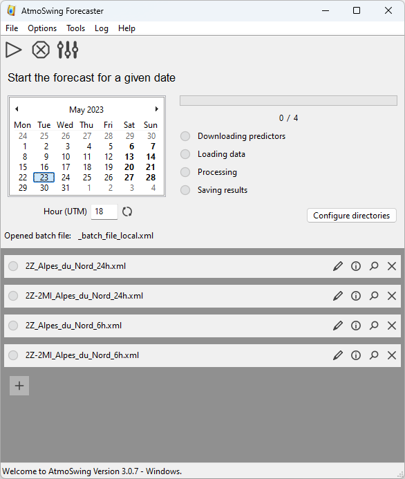

Usage
=====

.. todo:: write

.. image:: img/icon_run.png

.. image:: img/icon_stop.png

.. image:: img/icon_preferences.png

.. image:: img/icon-bullet_white.png

.. image:: img/icon-bullet_green.png

.. image:: img/icon-bullet_red.png

.. image:: img/icon-close.png

.. image:: img/icon-plus.png

.. image:: img/icon-update.png

.. image:: img/task-scheduler.png

