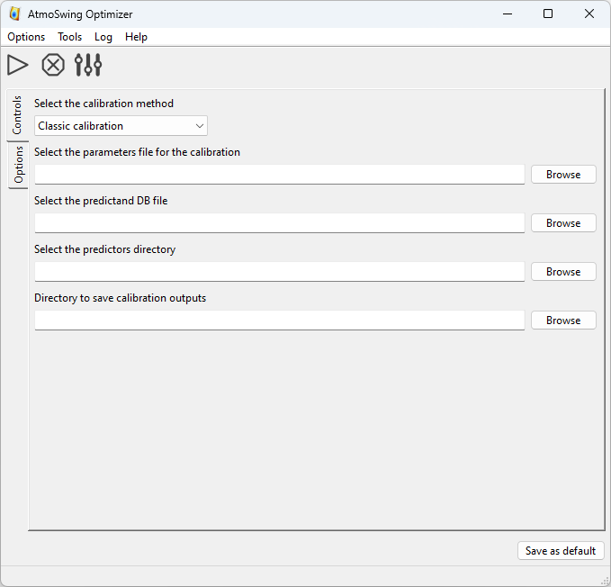

Usage
=====

The Optimizer implements different optimization techniques, such as a semi-automatic sequential approach, Monte-Carlo simulations, and a global optimization technique using genetic algorithms. Establishing a statistical relationship between predictors and predictands is computationally intensive because it requires numerous assessments over decades.

The calibration of the AM is usually performed in a perfect prognosis framework. Perfect prognosis uses observed or reanalyzed data to calibrate the relationship between predictors and predictands. As a result, perfect prognosis yields relationships that are as close as possible to the natural links between predictors and predictands. However, there are no perfect models, and even reanalysis data may contain biases that cannot be ignored. Thus, the considered predictors should be as robust as possible, i.e., they should have minimal dependency on the model.

A statistical relationship is established with a trial and error approach by processing a forecast for every day of a calibration period. A certain number of days close to the target date are excluded to consider only independent candidate days. Validating the parameters of AMs on an independent validation period is very important to avoid over-parametrization and to ensure that the statistical relationship is valid for another period. In order to account for climate change and the evolution of measuring techniques, it is recommended that a noncontinuous period for validation should be used, distributed over the entire archive (for example, every 5th year). AtmoSwing users can thus specify a list of the years to set apart for the validation that are removed from possible candidate situations. At the end of the optimization, the validation score is processed automatically.

Requirements
------------

The Optimizer needs:

* :ref:`A predictand database <predictand-db>`
* :ref:`A predictors archive (e.g. a reanalysis dataset) <reanalyses>`
* :ref:`Parameters files defining the properties of the method. <parameters-file-optimizer>`

Calibration methods
-------------------

The Optimizer provides different approaches listed below.

Evaluation-only approaches
~~~~~~~~~~~~~~~~~~~~~~~~~~

These methods do not seek to improve the parameters of the AM. They allow some assessments using the provided parameters.

* **Single assessment**: This approach processes the AM as described in the provided parameters file and assesses the defined score.
* **Evaluation of all scores**: Similar as above, but assesses all the implemented scores.
* **Only predictand values**: Does not process a performance score, but processes the AM and save the analog values into a file.
* **Only analog dates (and criteria)**: Does not process a performance score, neither assign predictand values to the analog dates. It only saves the analog dates identified by the defined AM into a file.

Based on the classic calibration
~~~~~~~~~~~~~~~~~~~~~~~~~~~~~~~~

The classic calibration is detailed :ref:`here<classic-calibration>`.

* **Classic calibration**: The :ref:`classic calibration <classic-calibration>`
* **Classic+ calibration**: A :ref:`variant of the classic calibration<classic-calibration>` with some improvements.
* **Variables exploration Classic+**: Using the classic+ calibration to systematically explore a list of variables / levels / hours.

Global optimization
~~~~~~~~~~~~~~~~~~~

* **Genetic algorithms**: The optimization using :ref:`genetic algorithms <genetic-algorithms>`.

Random exploration of the parameters space
~~~~~~~~~~~~~~~~~~~~~~~~~~~~~~~~~~~~~~~~~~

* **Monte-Carlo simulations**: An exploration of the parameters space using Monte-Carlo simulations. These simulations were found to be limited in terms of ability to find reasonable parameters sets for even moderately AMs.

Outputs
-------

The Optimizer produces different files:

* A text file with the resulting best parameters set and the skill score ([...]best_parameters.txt).
* A text file with all the assessed parameters set and their corresponding skill score ([...]tested_parameters.txt).
* An xml file with the best parameters set (to be used further by AtmoSwing Forecaster; [...]best_parameters.xml).
* A NetCDF file containing the analog dates (AnalogDates[...].nc) both for the calibration and validation periods.
* A NetCDF file containing the analog values (AnalogValues[...].nc) both for the calibration and validation periods.
* A NetCDF file containing the performance scores (Scores[...].nc) both for the calibration and validation periods.

Graphical user interface
------------------------

The main interface of the Optimizer is as follows.

The toolbar allows the following actions:

- |icon_run| Start the optimization.
- |icon_stop| Stop the current calculations.
- |icon_preferences| Define the preferences.

.. |icon_run| image:: img/icon_run.png
   :align: middle
   
.. |icon_stop| image:: img/icon_stop.png
   :align: middle

.. |icon_preferences| image:: img/icon_preferences.png
   :align: middle
   
What is needed:

* Select one of the  `calibration methods`_
* :ref:`The parameters file <parameters-file-optimizer>`
* :ref:`The predictand database <predictand-db>`
* The directory containing the :ref:`predictors for the archive period <reanalyses>`
* The directory to save the results
* All the options for the selected calibration method (in the Options tab; see below)

There is one tab to define the options of the classic calibration, the variables exploration, and the Monte-Carlo simulations. The details of the options are given :ref:`here<classic-calibration>`.

.. image:: img/frame-optimizer-options-calib.png
   :align: center

The other tab provides numerous options for genetic algorithms. The details of the options are given on the page of the :ref:`genetic algorithms <genetic-algorithms>`.

.. image:: img/frame-optimizer-options-gas.png
   :align: center

Command line interface
----------------------

The Optimizer also has a command line interface, which is the prefered way of using it. The options are as follows:

-h, --help  Displays the help of command line options
-v, --version  Displays the software version
-r, --run-number=<nb>  A given run number
-f, --file-parameters=<file>  File containing the parameters
--predictand-db=<file>  The predictand DB
--station-id=<id>  The predictand station ID
--dir-predictors=<dir>  The predictors directory
--skip-valid  Skip the validation calculation
--no-duplicate-dates  Do not allow to keep several times the same analog dates (e.g. for ensembles)
--dump-predictor-data   Dump predictor data to binary files to reduce RAM usage
--calibration-method=<method>  Choice of the calibration method: 

                        * ``single``: single assessment
                        * ``classic``: classic calibration
                        * ``classicp``: classic+ calibration
                        * ``varexplocp``: variables exploration classic+
                        * ``montecarlo``: Monte Carlo
                        * ``ga: genetic``: algorithms
                        * ``evalscores``: evaluate all scores
                        * ``onlyvalues``: evaluate all scores
                        * ``onlydates``: evaluate all scores

--cp-resizing-iteration=<int>  Classic plus: resizing iteration
--cp-lat-step=<step>  Classic plus: steps in latitudes for the relevance map
--cp-lon-step=<step>  Classic plus: steps in longitudes for the relevance map
--cp-proceed-sequentially  Classic plus: proceed sequentially
--ve-step=<step_nb>  Variables exploration: step to process
--mc-runs-nb=<runs_nb>  Monte Carlo: number of runs
--ga-  All GAs options are described on the :ref:`genetic algorithms <genetic-algorithms>` page
-n, --threads-nb=<n>  Number of threads to use
-l, --local  Work in local directory
-s, --silent  Silent mode
-l, --log-level=<n>  Set the log level (0: minimum, 1: errors, 2: warnings (default), 3: verbose)
