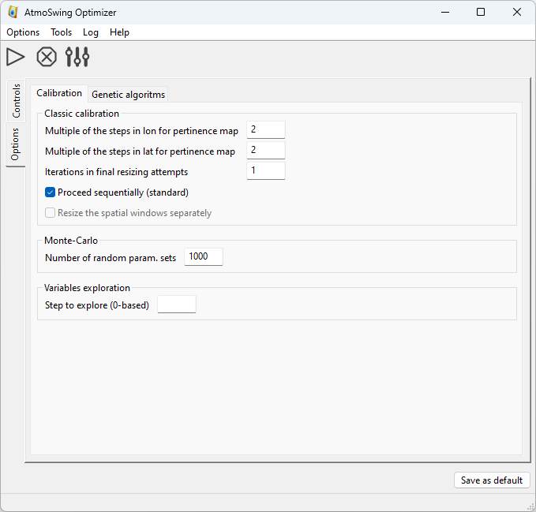

Usage
=====

.. todo:: write

.. image:: img/frame-optimizer-controls.png
   :align: center

   
.. image:: img/frame-optimizer-options-gas.png
   :align: center
   
.. image:: img/icon_run.png
   :align: center
   
.. image:: img/icon_stop.png
   :align: center
   
.. image:: img/icon_preferences.png
   :align: center
   
