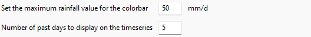
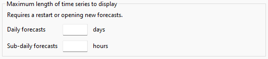
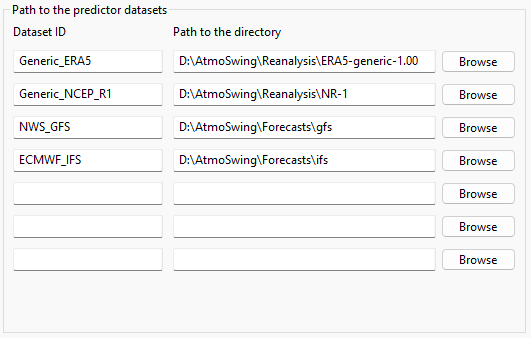
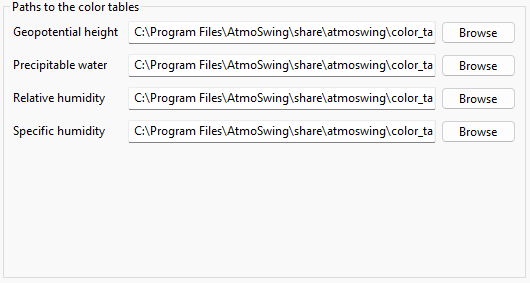
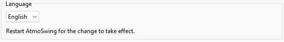

Preferences
===========

The preferences frame can be opened from the menu Options / Preferences of the main interface or with a button from the toolbar.

Workspace
---------

The propertied defined under this tab are specific for the workspace currently opened. 

The directory where the forecasts are stored must be provided:

.. image:: img/preferences-viewer-dir.png
   :align: center

The maximum predictand value for the color range defines the value for which red is assigned when colors are not standardized. The second option is the number of days of previous forecasts to be displayed as traces in the time series plots. Three to five days are recommended.

Alarm panel options: The alarm panel displays the highest value of all stations by lead time and method. The options are the return period for normalization and the quantile to be displayed. The quantile 0.9 allows remaining vigilant as to the possible occurrence of important events.

.. image:: img/preferences-viewer-alarmspanel.png
   :align: center

Maximum length of time series to display: The time series plots can be limited to a maximum number of lead times to hide too uncertain lead times. This limit has to be specified in a number of days for forecasts with a daily time step and hours for forecasts with a sub-daily time step. By default, no limit is applied.

Paths
-----

The paths to the predictor datasets must be provided along with their corresponding IDs to be found for the predictor maps.

Colors
------

The path to the color palette files can be changed for each type of predictor. The default color tables are provided in the AtmoSwing installation directory. AtmoSwing can parse .rbg and .act files.

General
-------
   
Language
~~~~~~~~

The language can be changed from the drop-down list. The change is effective after restarting the software.

Log options
~~~~~~~~~~~

Log preferences control the display of the log window and the level (importance) of reported messages:

1. Errors only - recommended as long as everything goes as planned.
2. Errors and warnings - some warnings help to be vigilant in case of problems. However, there might be warnings even during regular operation.
3. Verbose - all operations are reported, which is an unnecessary amount of information during regular operation. As a result, important messages might be hidden in a large number of messages. This option is only useful to identify where AtmoSwing is failing.

.. image:: img/preferences-general-log.png
   :align: center
   
Internet proxy
~~~~~~~~~~~~~~

If required, proxy options can be provided. The proxy configuration contains the following elements:

* Proxy activation - if necessary.
* Proxy properties - the proxy address, port, the user name, and password.

.. image:: img/preferences-general-proxy.png
   :align: center

Advanced
--------

Allow multiple instances of the Viewer, for example to display and compare different forecasts in separate windows.

.. image:: img/preferences-adv-multiinstances.png
   :align: center

Some paths automatically defined according to the OS: working directory, log file, and preferences file.

.. image:: img/preferences-adv-userpaths.png
   :align: center
