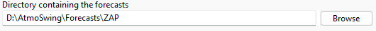
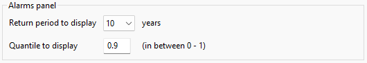
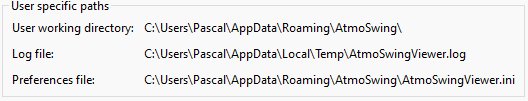

Preferences
===========

.. todo:: write

Workspace
---------

The propertied defined under this tab are specific for the workspace currently opened. 

The directory where the forecasts are stored must be provided:

The maximum precipitation value for the color range defines the value for which red is assigned when colors are not standardized. The second option is the number of days of previous forecasts to be displayed as traces in the graphs of the temporal evolution of precipitation at a station. 3~days are recommended here in order to limit the number of less relevant old traces.

.. image:: img/preferences-viewer-displayoptions.png

Alarm panel options: The alarm panel displays the highest value of all stations by date and model. The options are the return time for normalization and the quantile to be displayed. A return time of 10 years is recommended to avoid falling into the red too quickly. The quantile 0.9 allows to remain vigilant as to the possible occurrence of important events.

.. image:: img/preferences-general-log.png

.. image:: img/preferences-general-proxy.png

.. image:: img/preferences-adv-multiinstances.png

