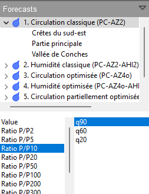
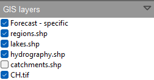

Usage
=====

.. todo:: write

.. image:: img/frame-viewer.png

.. image:: img/frame-viewer-rings.png

.. image:: img/icon_open.png

.. image:: img/icon_run.png

.. image:: img/icon_map_select.png

.. image:: img/icon_map_zoom_in.png

.. image:: img/icon_map_zoom_out.png

.. image:: img/icon_map_move.png

.. image:: img/icon_map_fit.png

.. image:: img/icon_frame_distributions.png

.. image:: img/icon_frame_analogs.png

.. image:: img/icon_preferences.png

.. image:: img/frame-plot-criteria-distrib.png

.. image:: img/frame-plot-precip-distrib.png

.. image:: img/frame-list-analogs.png

.. image:: img/frame-plot-timeseries.png

For the different layers, it is possible to change the following properties, if available:

* Visibility - whether the layer is visible or not by default.
* Transparency - 0% is opaque and 100% is fully transparent.
* Color - is applied to lines or surfaces.
* The thickness of the line - for the lines or perimeters of polygons.

.. image:: img/panel-alarms.png

.. image:: img/panel-stations.png

.. image:: img/panel-caption.png

