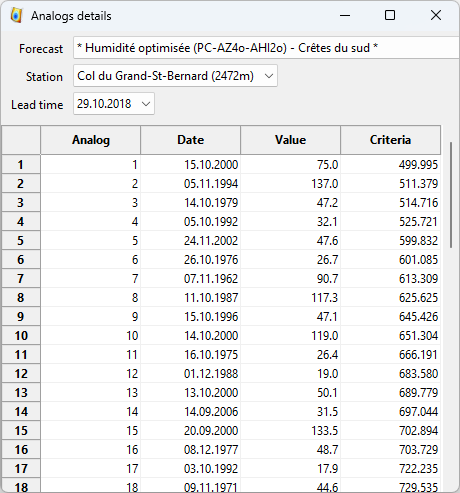

Usage
=====

.. todo:: write

The visualization software has the interface shown below. This tool allows you to view the files produced by the calculation software.

.. image:: img/frame-viewer.png

The toolbar allows the following actions:

- |icon_open| Open a forecast file
- |icon_run| Run the current forecast
- |icon_map_select| Select a station on the map
- |icon_map_zoom_in| Zoom in on the map
- |icon_map_zoom_out| Zoom out on the map
- |icon_map_move| Move the map
- |icon_map_fit| Adjust the map to all elements
- |icon_frame_distributions| Open distribution charts
- |icon_frame_analogs| Open the list of analogues
- |icon_preferences| Open the interface for setting preferences

.. |icon_run| image:: img/icon_run.png

.. |icon_map_select| image:: img/icon_map_select.png

.. |icon_map_zoom_in| image:: img/icon_map_zoom_in.png

.. |icon_map_zoom_out| image:: img/icon_map_zoom_out.png

.. |icon_map_move| image:: img/icon_map_move.png

.. |icon_map_fit| image:: img/icon_map_fit.png

.. |icon_frame_distributions| image:: img/icon_frame_distributions.png

.. |icon_preferences| image:: img/icon_preferences.png

.. image:: img/frame-viewer-rings.png

.. image:: img/frame-plot-criteria-distrib.png

.. image:: img/frame-plot-precip-distrib.png

.. image:: img/frame-plot-timeseries.png

.. image:: img/panel-forecasts.png

For the different layers, it is possible to change the following properties, if available:

* Visibility - whether the layer is visible or not by default.
* Transparency - 0% is opaque and 100% is fully transparent.
* Color - is applied to lines or surfaces.
* The thickness of the line - for the lines or perimeters of polygons.

.. image:: img/panel-layers.png

.. image:: img/panel-alarms.png

.. image:: img/panel-caption.png

