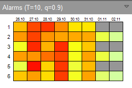
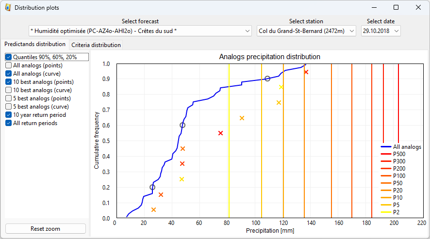

Usage
=====

The Viewer relies on `workspaces`_ (defined in files), where the path to the forecast files is specified as well as the GIS layers and other display options. It is thus possible to quickly change from one region to another.

For a given region, the forecasts can be separated/gathered based on an :ref:`identifier specified in the parameters files. <parameters-file>` (``<method_id>``). The Viewer will manage this information as follows:

* ``<method_id>``: all forecast files with the same ``<method_id>`` will be aggregated in the Viewer and labeled according to ``<method_id_display>``.
* ``<specific_tag>``: all subregion-specific methods (defined by ``<specific_tag>`` and labelled according to ``<specific_tag_display>``) but having the same ``<method_id>`` will be listed under the same heading. These specific forecasts for a subregion/basin are defined by specific parameters, and therefore have dates that may differ from other subregions. When one of these subregions is selected in the Viewer, the forecast for that specific method is displayed and the precipitation values for the other subregions (but for the same method) are grayed-out. When the header of the list is selected (i.e., the method), a summary of the optimal forecasts for each subregion is displayed (i.e., with analog dates that may differ from one subregion to another).

Main interface
--------------

AtmoSwing Viewer has the interface shown below. It allows viewing the files produced by the Forecaster. The forecasts are first explored through the main interface on a map. Different graphs are then available to display more details.

.. image:: img/frame-viewer.png
   :align: center

The toolbar allows the following actions:

- |icon_open| Open a forecast file
- |icon_run| Run the current forecast (calls the Forecaster)
- |icon_map_select| Select a station on the map
- |icon_map_zoom_in| Zoom in
- |icon_map_zoom_out| Zoom out
- |icon_map_move| Pan the map
- |icon_map_fit| Adjust the map to all stations
- |icon_frame_distributions| Open the distribution charts
- |icon_frame_analogs| Open the list of analogues
- |icon_preferences| Open the preferences

.. |icon_open| image:: img/icon_open.png
   :align: middle
   
.. |icon_run| image:: img/icon_run.png
   :align: middle

.. |icon_map_select| image:: img/icon_map_select.png
   :align: middle

.. |icon_map_zoom_in| image:: img/icon_map_zoom_in.png
   :align: middle

.. |icon_map_zoom_out| image:: img/icon_map_zoom_out.png
   :align: middle

.. |icon_map_move| image:: img/icon_map_move.png
   :align: middle

.. |icon_map_fit| image:: img/icon_map_fit.png
   :align: middle

.. |icon_frame_analogs| image:: img/icon_frame_analogs.png
   :align: middle

.. |icon_preferences| image:: img/icon_preferences.png
   :align: middle

It is possible to open |icon_open_s| several forecast files, but they must have the same reference date (issued at the same lead time). If forecasts corresponding to another date (or time) are already opened, they will be closed.

.. |icon_open_s| image:: img/icon_open.png
   :width: 32
   :height: 32
   :scale: 75
   :align: middle

The first visualization is a summary of the next lead times (Figure below). At the location of each station, a circular band is displayed with one box per lead time. The colors assigned to each slice illustrate the expected value for the lead time in question. This representation provides a quick overview of the coming days and makes it easy to identify a possible event. The same map can also be displayed for a specific lead time (Figure above). The choice of the lead time is made using the cursor above the map.

.. image:: img/frame-viewer-rings.png
   :align: center

Sidebar
~~~~~~~

The sidebar on the left-hand side of the map provides some information and controls.

**Forecasts**: Choice of method and its representation. All open methods are displayed in the upper box. The lower left box changes the color scale, and the lower right one offers the choice of the quantile to display (20%, 60%, or 90%).

.. image:: img/panel-forecasts.png
   :align: center
   
**GIS layers**: Display options for the opened GIS layers (right-click). It is possible to change the following properties of the different layers, if available:

* Visibility - whether the layer is visible or not.
* Transparency - 0% is opaque and 100% is fully transparent.
* Color - it is applied to the layer features (lines & fill).
* The thickness of the line - for the lines or perimeters of polygons.

.. image:: img/panel-layers.png
   :align: center
   
**Alarms**: Shows the potentially critical situations. The different rows of the grid correspond to the different open methods and the columns to the available lead times. The displayed colors correspond to the highest value of all stations (worst case; precipitation value normalized by the rain of a selected return period).

**Station selection**: Select the station to display the time series. An alternative to selection on the map.

.. image:: img/panel-stations.png
   :align: center

**Forecast caption**: Display of the dates corresponding to the different boxes of the circular bands, as well as the color bar.

.. image:: img/panel-caption.png
   :align: center

Display of the time series
~~~~~~~~~~~~~~~~~~~~~~~~~~

When a station is selected (on the map or in the drop-down list on the sidebar), the graph of the expected time series is displayed (Figure below). This graph corresponds to the selected method when clicking on the station. The display options (in the upper left panel) are as follows:

- The three classical quantiles (20%, 60%, 90%) in the form of thick blue lines.
- Every tenth of a quantile as a grey surface
- All analogs in the form of small grey crosses
- The ten best analogs as yellow - orange - red crosses. The colors are proportional to the rows of the analogs. Red is for the best analog and yellow for the 10th.
- The five best analogs according to the same principle.
- The value for a ten years return period in the form of a red line.
- The values of different return periods.
- Traces of the previous forecasts.

The lower left panel is the list of the previous forecasts. These are automatically imported when displaying the graph. 

.. image:: img/frame-plot-timeseries.png
   :align: center

Display of the distributions
~~~~~~~~~~~~~~~~~~~~~~~~~~~~

Rainfall distributions are accessible via the |icon_frame_distributions_s| button on the toolbar. It allows plotting the distribution of all analogs comparatively to the best 5 or 10 (Figure below). The display options are similar to those of the time series (previous section). The method, station, and lead time must be selected in the upper part of the window.

The distribution of the analogy criterion is also available in the same window through the tab located above the graph (Figure below). This distribution makes it possible to identify possible discontinuities in the values of the criteria and thus to increase the confidence in the best analogs.

.. image:: img/frame-plot-criteria-distrib.png
   :align: center

Display of the analog dates
~~~~~~~~~~~~~~~~~~~~~~~~~~~

The details of the analog dates and their associated criterion and predictand values (Figure below) are available through the |icon_frame_analogs_s| button on the toolbar. The method, station, and lead time must be selected in the upper part of the window. It is possible to sort the list by each of the columns by clicking on it. The first click ranks the values in ascending order and the second in descending order.

.. image:: img/frame-list-analogs.png
   :align: center

.. |icon_frame_analogs_s| image:: img/icon_frame_analogs.png
   :width: 32
   :height: 32
   :scale: 75
   :align: middle

Workspaces
----------

AtmoSwing Viewer relies on workspaces to allow changing of region or configuration. A workspace is an xml file containing the paths to the GIS layers and their rendering options, as well as the forecast files location and other properties that can be defined in the preferences. 

The menu File allows to:

* Open a workspace
* Save the workspace
* Save the workspace as
* Create a new workspace

The creation of a new workspace is guided by a wizard to define:

1. The location of the workspace file
2. The path to the forecasts directory
3. The base map for the project. 

The base map options are:

* Custom layers
* Terrain from Google maps
* Map from Google maps
* Map from OpenStreetMap
* Map from ArcGIS Mapserver
* Satellite imagery from Google maps
* Satellite imagery from VirtualEarth

The workspace file does not need (and should not be) directly edited. Its structure is as follows:

.. code-block:: xml

   <?xml version="1.0" encoding="UTF-8"?>
   <atmoswing version="1.0" target="viewer">
     <coordinate_system>EPSG:21781</coordinate_system>
     <forecast_directory>D:\_OwnCloud\AtmoSwing\CH-VS</forecast_directory>
     <colorbar_max_value>50</colorbar_max_value>
     <plot_time_series_past_days_nb>5</plot_time_series_past_days_nb>
     <panel_alarms_return_period>10</panel_alarms_return_period>
     <panel_alarms_quantile>0.900000</panel_alarms_quantile>
     <layers>
       <layer>
         <path>D:\AtmoSwing\GIS data\CH - Rhone\regions.shp</path>
         <type>vector</type>
         <transparency>0</transparency>
         <visibility>1</visibility>
         <line_width>2</line_width>
         <line_color>rgb(0, 0, 0)</line_color>
         <fill_color>rgb(0, 0, 0)</fill_color>
         <brush_style>106</brush_style>
       </layer>
       <layer>
         <path>D:\AtmoSwing\GIS data\CH - Rhone\lakes.shp</path>
         <type>vector</type>
         <transparency>0</transparency>
         <visibility>1</visibility>
         <line_width>1</line_width>
         <line_color>rgb(0, 128, 255)</line_color>
         <fill_color>rgb(0, 128, 255)</fill_color>
         <brush_style>100</brush_style>
       </layer>
       <layer>
         <path>D:\AtmoSwing\GIS data\CH - Rhone\hydrography.shp</path>
         <type>vector</type>
         <transparency>0</transparency>
         <visibility>1</visibility>
         <line_width>1</line_width>
         <line_color>rgb(0, 128, 255)</line_color>
         <fill_color>rgb(0, 0, 0)</fill_color>
         <brush_style>100</brush_style>
       </layer>
       <layer>
         <path>D:\AtmoSwing\GIS data\CH - Rhone\catchments.shp</path>
         <type>vector</type>
         <transparency>0</transparency>
         <visibility>0</visibility>
         <line_width>1</line_width>
         <line_color>rgb(255, 255, 0)</line_color>
         <fill_color>rgb(0, 0, 0)</fill_color>
         <brush_style>106</brush_style>
       </layer>
       <layer>
         <path>D:\AtmoSwing\GIS data\CH - Rhone\SRTM\CH.tif</path>
         <type>raster</type>
         <transparency>0</transparency>
         <visibility>1</visibility>
         <line_width>0</line_width>
         <line_color></line_color>
         <fill_color></fill_color>
         <brush_style>0</brush_style>
       </layer>
     </layers>
   </atmoswing>

