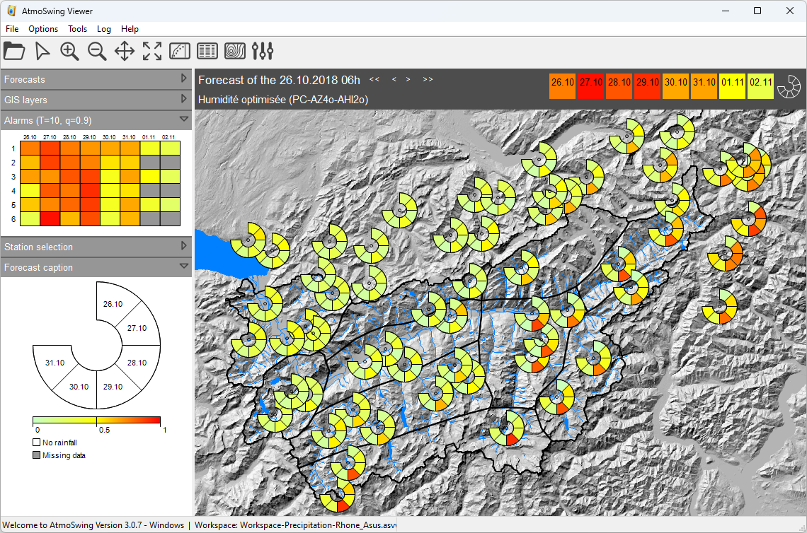

Usage
=====

.. todo:: write

Main interface
--------------

The visualization software has the interface shown below. This tool allows you to view the files produced by the calculation software.

The toolbar allows the following actions:

- |icon_open| Open a forecast file
- |icon_run| Run the current forecast
- |icon_map_select| Select a station on the map
- |icon_map_zoom_in| Zoom in on the map
- |icon_map_zoom_out| Zoom out on the map
- |icon_map_move| Move the map
- |icon_map_fit| Adjust the map to all elements
- |icon_frame_distributions| Open distribution charts
- |icon_frame_analogs| Open the list of analogues
- |icon_preferences| Open the interface for setting preferences

.. |icon_open| image:: img/icon_open.png
   :align: middle
   
.. |icon_run| image:: img/icon_run.png
   :align: middle

.. |icon_map_fit| image:: img/icon_map_fit.png
   :align: middle

.. |icon_frame_distributions| image:: img/icon_frame_distributions.png
   :align: middle

.. |icon_frame_analogs| image:: img/icon_frame_analogs.png
   :align: middle

.. |icon_preferences| image:: img/icon_preferences.png
   :align: middle

The results are first explored through the main interface on a map. Different graphs are then available to view more details.

It is possible to open |icon_open_s| several model results, but they must have the same base date. If forecasts corresponding to a date (or time) other than the files already opened are loaded, they will be closed.

.. |icon_open_s| image:: img/icon_open.png
   :width: 32
   :height: 32
   :scale: 50
   :align: middle

The first visualization offered to the user when he opens a file is a summary of the next deadlines (Figure below). At the location of each station a circular band is displayed with one box per deadline. The colours assigned to each trap are proportional to the expected value for the deadline in question. This representation provides a quick overview of the coming days and makes it easy to identify a possible event. An alternative view of this map allows you to display the forecasts by maturity (Figure above). This representation helps to better distinguish spatialization from precipitation, as well as to quickly access the values of certain quantiles. The choice of the deadline is made using the cursor above the map.

Sidebar
*******

To the left of the map is a sidebar to control the map display. 

**Forecasts**: Choice of model and display. All open models are displayed in the upper box. The lower left box changes the color scale, and the one on the right is the choice of the quantile to display (20%, 60% or 90%).

.. image:: img/panel-forecasts.png

**GIS layers**: Choice of display of open GIS layers. For the different layers, it is possible to change the following properties, if available:

* Visibility - whether the layer is visible or not by default.
* Transparency - 0% is opaque and 100% is fully transparent.
* Color - is applied to lines or surfaces.
* The thickness of the line - for the lines or perimeters of polygons.

.. image:: img/panel-layers.png

**Alarms**: Potentially critical situations. The different rows of the grid correspond to the different open models and the columns to the available deadlines. The displayed colors correspond to the highest ratio (rain value normalized by the rain of a selected return time) of all stations.

.. image:: img/panel-alarms.png

**Station selection**: Select the station to display the time series. Alternative to selection on the map.

.. image:: img/panel-stations.png

**Forecast caption**: Map legend. Display of the dates corresponding to the different boxes of the circular bands, as well as the color bar.

.. image:: img/panel-caption.png

Display of the time series
**************************

.. image:: img/frame-plot-precip-distrib.png

.. image:: img/frame-list-analogs.png

