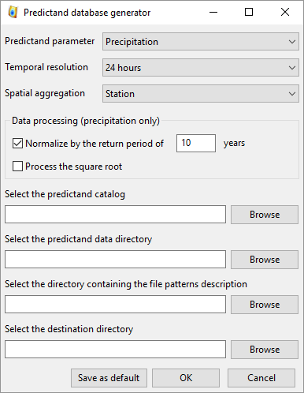

Predictand DB
=============

.. todo:: write

The precipitation database must be generated again when adding years of measurements. Database generation consists of extracting data from text files and combining them into a NetCDF file.

During this data processing, Gumbel adjustments are automatically made to calculate the precipitation values corresponding to different return times.

The interface for generating the rainfall database is accessible through the Tools / Bluid predictand DB menu.

The first step is to choose the type of database to generate. The options are as follows:

* Predictand parameter:
   * Precipitation
   * Temperature
   * Lightnings
   * Other
* Temporal resolution:
   * 24 hours
   * 6 hours
   * 1-hr MTW (moving time window)
   * 3-hr MTW (moving time window)
   * 6-hr MTW (moving time window)
   * 12-hr MTW (moving time window)
* Spatial aggregation:
   * Station
   * Groupment
   * Catchment

The selected database type will then be searched in the catalogue. It is therefore the latter that determines which network and which stations to include in the selection. The catalogue also contains information on the station's positioning and measurement periods. Finally, the data files and their structure are also determined by this same catalogue. The files will be searched in the directory entered in the first field (Select the predictand data directory). The structure defines how to read data files. This structure is described in files, located in the folder given under Select the directory containing the file patterns description.

After execution, a NetCDF file containing all the data necessary for the software is created in the chosen directory. This file also includes the station properties and allows us to do without the predictand catalogue for further operations.

Precipitation file structure

It was chosen not to force the user to transform his data into a specific format, but to let him describe the structure of his files. This must be done using files describing the structure of the series. However, a restriction is imposed: a data file must contain only one time series (single station).

Files can be structured in two common modes:

* Delimited by tabs (tabsdelimited)
* With constant line width (constantwidth)

An option (parsetime) allows you to read the time information, or ignore it. Reading this information allows an automatic check of the correct consistency of the dates between what the software thinks it is reading and what it is actually reading. It is therefore recommended to activate this option (parsetime = 1).

This type defines structured files in a very simple way, either with date elements (year, month, day) and data separated by tabs (see example below). The files contain exactly 2 header lines.

.. code:: text

	Timeseries processed by XY for the YZ project.
	average from station(s) : 8080 8010 
	1961	1	1	6.600000
	1961	1	2	2.600000
	1961	1	3	21.500000
	1961	1	4	4.500000
	1961	1	5	0.000000
	1961	1	6	5.800000
	1961	1	7	0.000000
	1961	1	8	3.400000
	1961	1	9	0.000000
	1961	1	10	1.500000

The structure describing such data files is as follows:

.. code:: xml

  <?xml version="1.0" encoding="UTF-8" ?>
  <atmoswing version="1.0">
    <pattern id="Basic_daily" name="Basic daily file structure with tabs">
      <structure_type>tabs_delimited</structure_type>
      <header_lines>2</header_lines>
      <parse_time>1</parse_time>
      <time>
        <year column="1"/>
        <month column="2"/>
        <day column="3"/>
      </time>
      <data>
        <value column="4"/>
      </data>
    </pattern>
  </atmoswing>

