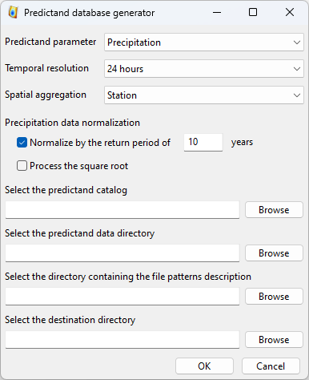

.. _predictand-db:

Predictand DB
=============

The preditand data (e.g., precipitation) must be prepared for use in AtmoSwing. A tool provided along AtmoSwing allows for the 'database' generation. Database generation consists of extracting data from text files and combining them into a NetCDF file.

The interface for generating the precipitation database is accessible through the 'Tools / Build predictand DB' menu from any AtmoSwing module.

The first step consists in choosing the type of database to generate. The options are as follows:

* Predictand parameter:
   * Precipitation
   * Temperature
   * Lightning
   * Other
* Temporal resolution:
   * 24 hours
   * 6 hours
   * 1-hr MTW (moving time window, see :cite:t:`Horton2017b`)
   * 3-hr MTW (moving time window, see :cite:t:`Horton2017b`)
   * 6-hr MTW (moving time window, see :cite:t:`Horton2017b`)
   * 12-hr MTW (moving time window, see :cite:t:`Horton2017b`)
* Spatial aggregation:
   * Station
   * Groupment
   * Catchment
   * Region

The resulting file will contain the raw predictand data, but can also contain transformed data depending on the predictand variable (see section `Transformed data`_).

Next, a couple of paths must be provided:

* The predictand catalog: `a catalog (xml file) <#predictand-catalog>`_ is required to provide some metadata on the different time series.
* The predictand data directory: the directory containing the original predictand files.
* The file patterns description directory: the directory containing `files defining the structure <#predictand-file-structure>`_ of the original predictand files.
* The destination directory: where the resulting file will be saved.

After execution, a NetCDF file containing all the data necessary for the software is created in the chosen directory. This file also includes the station properties and time series.

Transformed data
----------------

In addition to the raw predictand data, the resulting NetCDF file can also contain transformed data. The available options depend on the predictand variable. It is important to note that this normalized data will be used for the calibration of the method, but the raw data is used in the Forecaster and the Downscaler.

Precipitation
~~~~~~~~~~~~~

During the data processing, Gumbel adjustments are automatically made to calculate the precipitation values corresponding to different return periods. The possible transformations are then:

* A normalization of the precipitation amount by a chosen return period value (often 10 years)
* A transformation by the square root of the normalized precipitation amounts (see :cite:t:`Bontron2004`)

Lightning
~~~~~~~~~

The lightning data can be transformed using: log10( N + 1 )

Predictand catalog
------------------

The predictand catalog provides some metadata on the predictand time series. It is only required to create the predictand database and is not used afterwards. It consists of an xml file such as:

.. code-block:: xml

    <?xml version="1.0" encoding="UTF-8" ?>

    <atmoswing version="1.0">
      <dataset>
        <id>MeteoSwiss-Switzerland</id>
        <name>MeteoSwiss daily rainfall measurements for Switzerland</name>
        <description>Daily precipitation measurements for Switzerland</description>
        <parameter>Precipitation</parameter>
        <unit>mm</unit>
        <temporal_resolution>Daily</temporal_resolution>
        <spatial_aggregation>Station</spatial_aggregation>
        <time_zone>0</time_zone>
        <start note="first value of all stations">01/01/1864</start>
        <end note="last value of all stations">31/12/2015</end>
        <first_time_step>0</first_time_step>
        <nan>-</nan>
        <coordinate_system>EPSG:21781</coordinate_system>

        <stations>
          <station>
            <id>1</id>
            <name>Aarberg</name>
            <official_id>ABE</official_id>
            <x_coordinate>588051</x_coordinate>
            <y_coordinate>209518</y_coordinate>
            <height>493</height>
            <file_name>ABE_rre150d0_data.txt</file_name>
            <file_pattern>MeteoSwiss_IDAweb_bulletin</file_pattern>
            <start>01/01/1900</start>
            <end>31/12/2015</end>
          </station>
          <station>
            <id>2</id>
            <name>L’Abergement</name>
            <official_id>ABG</official_id>
            <x_coordinate>527540</x_coordinate>
            <y_coordinate>178770</y_coordinate>
            <height>645</height>
            <file_name>ABG_rre150d0_data.txt</file_name>
            <file_pattern>MeteoSwiss_IDAweb_bulletin</file_pattern>
            <start>01/01/1961</start>
            <end>31/12/2015</end>
          </station>
          
          ...
          
          <station>
            <id>301</id>
            <name>Zweisimmen</name>
            <official_id>ZWE</official_id>
            <x_coordinate>595870</x_coordinate>
            <y_coordinate>155480</y_coordinate>
            <height>1015</height>
            <file_name>ZWE_rre150d0_data.txt</file_name>
            <file_pattern>MeteoSwiss_IDAweb_bulletin</file_pattern>
            <start>01/01/1901</start>
            <end>31/12/2015</end>
          </station>

        </stations>
      </dataset>

    </atmoswing>

The dataset is described by the following data:

* ``<id>``: a name given to the dataset (short)
* ``<name>``: the full name of the dataset
* ``<description>``: additional description (optional)
* ``<parameter>``: the measured parameter (see above; ex: Precipitation)
* ``<unit>``: the unit of the measure (ex: mm)
* ``<temporal_resolution>``: the temporal resolution (see above; ex: Daily)
* ``<spatial_aggregation>``: the spatial aggregation (see above; ex: Station)
* ``<time_zone>``: time zone of the measurement time (ex: 0 for UTC)
* ``<start>``: first time step of all stations DD/MM/YYYY (ex: 01/01/1864)
* ``<end>``: last time step of all stations DD/MM/YYYY (ex: 31/12/2015)
* ``<first_time_step>``: first time step (ex: 0)
* ``<nan>``: representation of nan values
* ``<coordinate_system>``: the EPSG code of the coordinate system (ex: EPSG:21781)

Then, every time series (named here 'station', even if they are not representing a station) must be detailed under a ``<station>`` tag in the ``<stations>`` list. For every station, the following information can/must be provided:

* ``<id>``: a unique ID (integer) to identify the station in AtmoSwing (unique number for the considered catalog)
* ``<name>``: the name of the station
* ``<official_id>``: an official ID (optional)
* ``<x_coordinate>``: the X coordinate (in the coordinate system defined for the dataset)
* ``<y_coordinate>``: the Y coordinate (in the coordinate system defined for the dataset)
* ``<height>``: the station height (optional)
* ``<file_name>``: the file name containing the original data
* ``<file_pattern>``: `the pattern describing the data file structure <#predictand-file-structure>`_
* ``<start>``: the start of the time series DD/MM/YYYY
* ``<end>``: the end of the time series DD/MM/YYYY

Predictand file structure
-------------------------

It was chosen not to force users to transform their data into a specific format but to let them describe the structure of the files. It must be done using files describing the structure of the original time series. The structure file defines how to read data files and is described in text files. However, a restriction is imposed: a data file must contain only one time series (single station), or structure files must be defined to read a specific column.

Files can be structured (``<structure_type>``) in two common types:

* Delimited by tabs (``tabsdelimited``)
* With constant width (``constantwidth``)

An option (``<parsetime>``) allows reading the date/time entries or ignore them. Reading this information allows an automatic check of the correct consistency of the dates between what the software thinks it is reading and what it is actually reading. It is therefore recommended to enable this option (``<parse_time>1</parse_time>``).

Several files are installed with AtmoSwing and can be found in the 'data/file_patterns' directory, or `online in the repository <https://github.com/atmoswing/atmoswing/tree/master/data/file_patterns>`_.

Example of the type 'delimited by tabs'
~~~~~~~~~~~~~~~~~~~~~~~~~~~~~~~~~~~~~~~

This type straightforwardly defines structured files, eventually with date entries (year, month, day) and data separated by tabs (see example below). The files contain exactly two header lines:

.. code-block:: text

	Timeseries processed by XY for the YZ project.
	average from station(s) : 8080 8010 
	1961	1	1	6.6
	1961	1	2	2.6
	1961	1	3	21.5
	1961	1	4	4.5
	1961	1	5	0.0
	1961	1	6	5.8
	1961	1	7	0.0
	1961	1	8	3.4
	1961	1	9	0.0
	1961	1	10	1.5

The structure describing such data files is as follows:

.. code-block:: xml

  <?xml version="1.0" encoding="UTF-8" ?>
  <atmoswing version="1.0">
    <pattern id="Basic_daily" name="Basic daily file structure with tabs">
      <structure_type>tabs_delimited</structure_type>
      <header_lines>2</header_lines>
      <parse_time>1</parse_time>
      <time>
        <year column="1"/>
        <month column="2"/>
        <day column="3"/>
      </time>
      <data>
        <value column="4"/>
      </data>
    </pattern>
  </atmoswing>

Example of the type 'constant width'
~~~~~~~~~~~~~~~~~~~~~~~~~~~~~~~~~~~~

Predictand files are here structured as constant columns width.

.. code-block:: text

    ...
    ...
    stn    time           rre150d0
    ABG    19610101            4.3
    ABG    19610102           10.2
    ABG    19610103           14.1
    ABG    19610104            2.4
    ABG    19610105            2.6
    ABG    19610106            3.7
    ABG    19610107            0.0
    ABG    19610108            6.5
    ABG    19610109            0.0
    ABG    19610110           10.7

The structure describing such data files is as follows:

.. code-block:: xml

    <?xml version="1.0" encoding="UTF-8" ?>
    <atmoswing version="1.0">
      <pattern id="MeteoSwiss_IDAweb_bulletin" name="MeteoSwiss data pattern from IDAweb">
        <structure_type>constant_width</structure_type>
        <header_lines>3</header_lines>
        <parse_time>1</parse_time>
        <time>
          <year char_start="8" char_end="11"/>
          <month char_start="12" char_end="13"/>
          <day char_start="14" char_end="15"/>
        </time>
        <data>
          <value char_start="25" char_end="30"/>
        </data>
      </pattern>
    </atmoswing>
